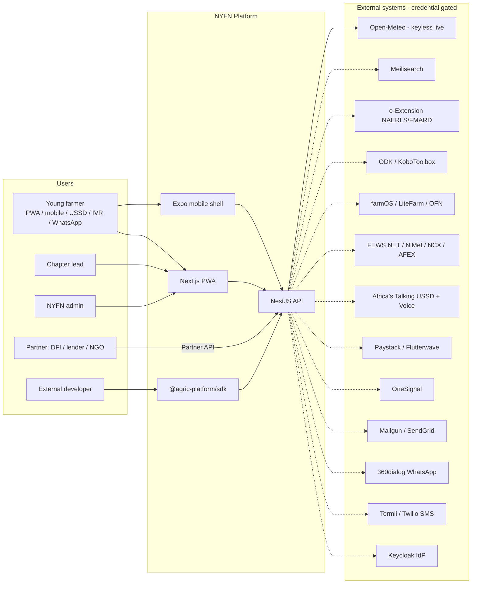
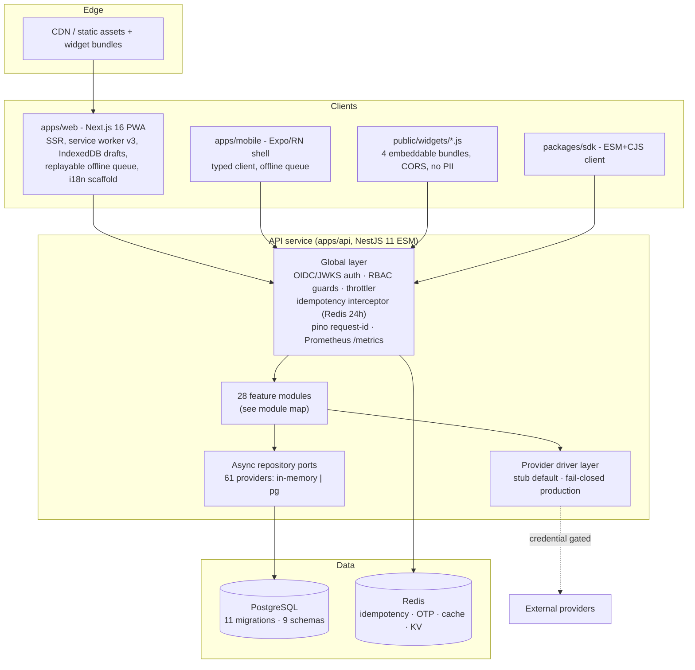
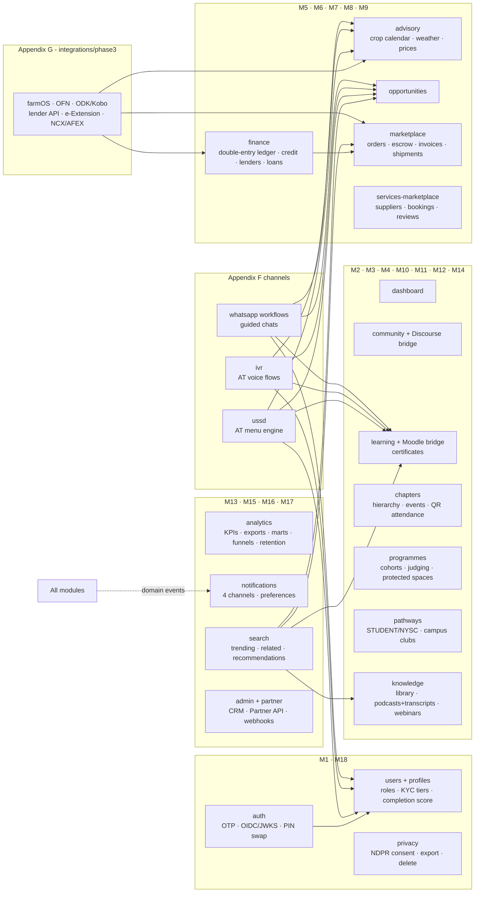
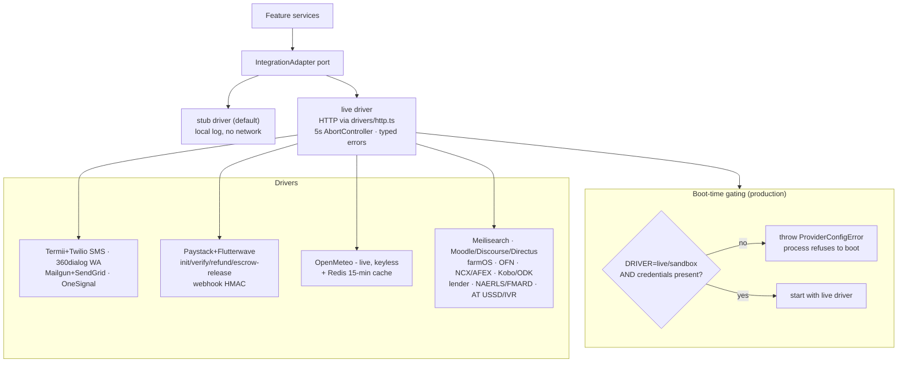
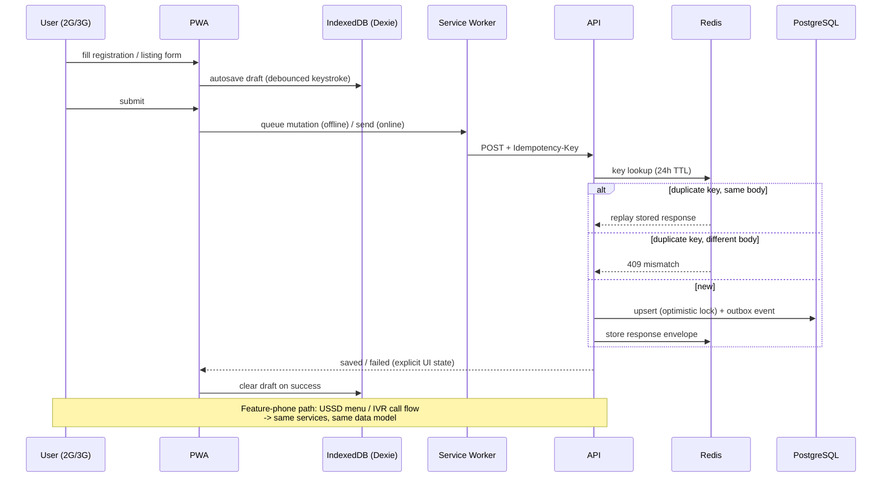
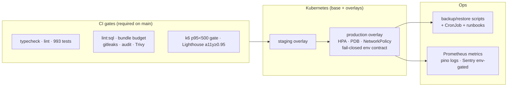

# AgricPlatform — Implemented Architecture

**As implemented:** main @ Stage 10 (PRD v3.3 full build-out, waves P1–P6). 993 automated tests green, 11 SQL migrations, fail-closed provider layer.

This document describes what is **actually implemented in the repository**, not the target-state proposal in the PRD. External systems are shown dashed; adapters are stub-by-default and fail closed in production without credentials.

---

## 1. System context

## 2. Container view (deployed units)

## 3. Module map (18 PRD modules → implementation)

## 4. Provider driver layer (fail-closed contract)

## 5. Low-connectivity data flow (Appendix F pattern, as implemented)

## 6. Persistence overview (11 migrations)

| Migration | Schema / tables | Domain |
| --- | --- | --- |
| 001_init | identity, learning, community, chapters, advisory, marketplace, finance (vault), notifications, analytics, admin — 27 repos | Phase 1 core |
| 002_audit_hash_chain | audit chain columns | Tamper-evident audit |
| 003_commerce_finance | marketplace.escrow_records, invoices, shipments; finance.credit_scores, lenders, loan_applications, repayment_installments; ledger transfers | M7 + M9 |
| 004_engagement | services, programmes, pathways, knowledge, search — 24 tables | M8/M11/M12/M14/M16 |
| 005_attendance_exports | chapters.event_participation scan columns | M10 QR |
| 006_market_data | advisory.commodity_prices | M5 feeds |
| 007_phase3_integrations | integrations.external_account_links, farm_records, import_batches/records, inbound_events | Appendix G |
| 008_ussd_channels | channels.ussd_sessions, pin_profiles | Appendix F |
| 009_analytics_marts | analytics_marts.member_kpis/marketplace/learning_daily | M13 lakehouse handoff |
| 010_partner_api | partners.partner_clients, api_keys, webhook_subscriptions | Partner API/SDK |
| 011_ivr | channels.ivr_calls | IVR (Stage 10) |

## 7. Security & compliance layers

1. **Identity**: Keycloak OIDC/JWKS (jose) bearer verification; hardened OTP (expiry/attempts/lockout); PIN session swap with lockout; dev-header fallback disabled in production.
2. **Access**: RBAC guards per module; ownership-or-admin on sensitive routes; partner scope claims + per-client rate buckets (Redis).
3. **Integrity**: idempotency keys (replay / 409 mismatch), webhook HMAC (platform + Paystack SHA-512 + Flutterwave verif-hash), tamper-evident audit hash chain, signed QR attendance codes (fail-closed secret).
4. **Privacy**: NDPR consent capture, export/delete endpoints, consent-gated federation sharing (denial tested), anonymised lender pushes.
5. **Pipeline**: gitleaks, npm audit (blocking), Trivy, secret-scan clean, CSP/security headers, WCAG AA axe gates, bundle budget 250KB.

## 8. Deployment view

**Environment contract (fail-closed in production):** `DATABASE_URL`, `REDIS_URL` (no in-memory persistence/cache), Keycloak JWKS, `ATTENDANCE_SIGNING_SECRET`, `PARTNER_API_SIGNING_SECRET`, and any `*_DRIVER=live` flag without its credentials — the process refuses to boot.
